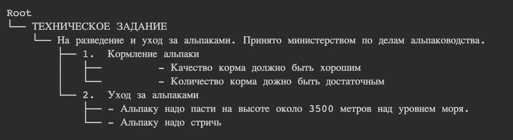

# Parsing documents in docx format

### 1. How to install

```bash
git clone https://github.com/NastyBoget/DOCXParser

pip install -r requirements.txt
```

### 2. Read docx document with annotations

```python
from docx_parser.document_parser import DOCXParser


doc_name = "path to the docx file"
docx_parser = DOCXParser()
docx_parser.parse(doc_name)
docx_parser.get_lines_with_meta()
```

`get_lines_with_meta()` method allows getting list of dictionaries with annotations for each document paragraph:

```python
{'text': 'some text',  # text of each paragraph
 'level': None,  # may be tuple, e.g. (1, 1) (see code for more details)
 'uid': 'e9c87f98bffab8a6b576c9f232f6910c_a9c66dbe50d3a99771a25955712274f4',  # unique identifier of each paragraph  
 'type': 'raw_text',  # may be "paragraph" ,"list_item", "raw_text" or "style_header"
 # list of annotations for current paragraph
 # each annotation is like ("name", start, end, "value") where
 # name - name of annotation, may be "indentation", "alignment", "bold", "italic", "underlined", "size", "style"
 # start, end - character's positions (where annotation applied) begin with 0, end isn't included
 'annotations': [('indentation', 0, 9, '0'),  # indentation from the left margin of document
                 ('alignment', 0, 9, 'center'),  # alignment, may be "left", "right", "both", "center"
                 ('bold', 0, 9, 'True'),  # indicate if font is bold (italic and underlined are the same)
                 ('size', 0, 9, '12.0'),  # font size
                 ('style', 0, 9, 'normal')]}  # name of the style
```

### 3. Use classifier for technical specification documents

```python
from classifiers.tz_classifier.tz_classifier import TzLineTypeClassifier
from docx_parser.document_parser import DOCXParser


doc_name = "path to the docx file"
docx_parser = DOCXParser()
docx_parser.parse(doc_name)
lines = docx_parser.get_lines_with_meta()

tz_classifier = TzLineTypeClassifier.load_pickled(config={})
tz_classifier.predict(lines)
```

Each paragraph will get a label according to the rules for technical specification documents.
There are 5 types of paragraphs:

1. title
2. toc (table of contents)
3. part (some structure unit)
4. item (list item)
5. raw_text

For example given above `predict()` method can return the following data:

```python
{'text': 'some text',
 'label': 'raw_text',  # may be "title", "toc", "part", "item", "raw_text"
 'level': None, 
 'uid': 'e9c87f98bffab8a6b576c9f232f6910c_a9c66dbe50d3a99771a25955712274f4',
 'type': 'raw_text',  
 'annotations': [('indentation', 0, 9, '0'), 
                 ('alignment', 0, 9, 'center'),
                 ('bold', 0, 9, 'True'),
                 ('size', 0, 9, '12.0'),
                 ('style', 0, 9, 'normal')]}
```

### 4. Get tree structure from docx document

```python
from classifiers.pair_classifier.pair_classifier import PairClassifier
from classifiers.tree_constructor.tree_constructor import DocumentTreeConstructor
from docx_parser.document_parser import DOCXParser


doc_name = "path to the docx file"
pair_classifier = PairClassifier.load_pickled(config={})
docx_parser = DOCXParser()
docx_parser.parse(doc_name)
lines = docx_parser.get_lines_with_meta()

tree_constructor = DocumentTreeConstructor(comparator=pair_classifier)
tree_constructor.construct_tree(lines)
```

`construct_tree()` method returns tree structure in a dictionary, where each node is:

```python
{"type": "some type",  # type of the paragraph e.g. from tz_classifier
 "data": {},  # contents of line_with_meta for paragraph
 "children": [],  # list of analogous dictionaries for children paragraphs
 "parent": {}}  # analogous dictionary of parent paragraph
```

### 5. Get tree structure with typed paragraphs

If you want to add types of paragraphs to the tree,
you should use classifier to get paragraph's types.

Code is almost the same:

```python
from classifiers.pair_classifier.pair_classifier import PairClassifier
from classifiers.tree_constructor.tree_constructor import DocumentTreeConstructor
from classifiers.tz_classifier.tz_classifier import TzLineTypeClassifier
from docx_parser.document_parser import DOCXParser


doc_name = "path to the docx file"
pair_classifier = PairClassifier.load_pickled(config={})
tz_classifier = TzLineTypeClassifier.load_pickled(config={})
docx_parser = DOCXParser()
docx_parser.parse(doc_name)
lines = docx_parser.get_lines_with_meta()

tree_constructor = DocumentTreeConstructor(comparator=pair_classifier, line_type_classifier=tz_classifier)
doc_tree = tree_constructor.construct_tree(lines, with_type=True)
```

### 6. Visualize document tree structure

You can get visual representation of tree structure:

```python
from classifiers.tree_constructor.tree_visualization import visualize_tree

doc_tree = tree_constructor.construct_tree(lines, with_type=True)

tree = visualize_tree(doc_tree, with_type=False)
tree.show()
```

You'll get something like this:
