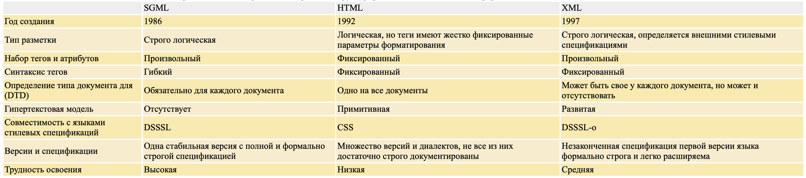
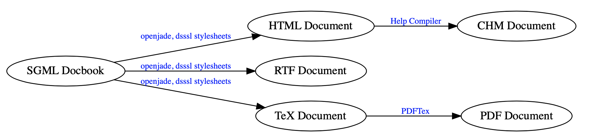
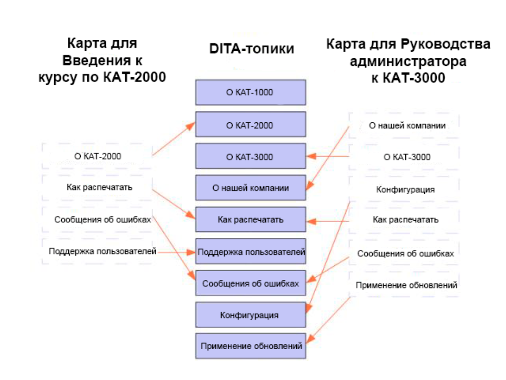

# Обзор по извлечению структуры из документов

* Тема ВКР: 
**Извлечение иерархической логической структуры из текстовых документов в формате docx.**

Существует два типа структуры документов: физическая и логическая. 
Физическая структура документа связана с визуальным представлением документа, 
то есть как документ разбит на страницы, как страницы разбиты на блоки, блоки на текстовые строки (или изображения) и т. д.
Логическая структура документа предполагает извлечение структуры, осмысленной для данного типа документов.
Так, научные статьи делятся на секции, подсекции и т. д., которые, в свою очередь, могут иметь смысл (введение, список литературы) и делиться на части.

Разные форматы для хранения текстовых документов разрабатывались для разных целей.
Рассмотрим некоторые из форматов, которые использовались и используются для хранения 
и представления логической и физической структуры документа.

## 1. Обзор по форматам документов

**Сравнительная таблица по форматам документов**

| Название | Основная цель | Основан на | Физическая структура | Логическая структура | Программная поддержка | Сложность | Читаемость |
|:--------:|:-------------:|:----------:|:--------------------:|:--------------------:|:---------------------:|:---------:|:----------:|
|[SGML](https://www.xmlgrrl.com/publications/DSDTD/ch01.html)| Для совместного использования машинно-читаемых документов в больших проектах | GML | Не предназначен для хранения физической структуры | Создан для этого | Есть (но формат устарел) | Спецификация одна, но сложна в освоении | Читаемо, но не всегда удобно | 
|[DAFS](https://www.worldscientific.com/doi/abs/10.1142/9789812830968_0016)| Для результатов распознавания изображений документов | SGML | Дерево физической структуры | Дерево логической структуры | Сейчас не используется, скорее всего нет | Много сложных понятий | Вряд ли легко воспринимать, но примеров представления не найдено |
|[XML](https://ru.wikipedia.org/wiki/XML)| Для создания и обработки документов программами и одновременно удобный для человека | SGML | Можно использовать | Можно использовать | Есть, обширная | Средняя сложность | Достаточно удобно читать |
|[DocBook](http://www.cs.unibo.it/~cianca/wwwpages/dd/Docbook.pdf)| Для технической документации | SGML/XML | Не предоставляет информацию о визуальном представлении документа | Представляет возможность описания логической структуры | Есть | Стандарт большой и сложный в освоении | Читаемо, есть стредства для визуализации |
|[DITA](https://philosoft-services.com/dita-intro.zhtml)| Для эффективного повторного использования контента | XML | Как выглядит документ контролируют выходные форматы | Для логической структуры используется семантическое тегирование | Есть | Есть специфические понятия, которые нужно знать для работы | Содержимое разбито на части (может быть неудобно), визуализация в выходных форматах |
|[HTML](https://ru.wikipedia.org/wiki/HTML), [XHTML](https://ru.wikipedia.org/wiki/XHTML), [HTML5](https://ru.wikipedia.org/wiki/HTML5)| Язык для структурирования и представления содержимого всемирной паутины | SGML/XML | Есть обширные возможности для описания того, как выглядит документ | Есть возможность описания | Есть | Относительно несложные и известные многим форматы| Читаемо и визуализируется в браузерах |
|[ALTO](https://www.loc.gov/standards/alto/) + [METS](http://www.loc.gov/standards/mets/METSPrimer.pdf)| Для хранения результатов OCR | XML | Описывается в ALTO | Описывается в METS | Есть | Сложно | Есть инструменты визуализации |
|[TEI](https://tei-c.org) [(TEI Lite)](https://tei-c.org/release/doc/tei-p5-exemplars/pdf/tei_lite.doc.pdf)| Для семантики и логической структуры | XML | Существуют несколько тегов для описания визуальных особенностей текста | Создан для отображения логической структуры | Обширный список различных [инструментов](https://wiki.tei-c.org/index.php/Category:Tools) для работы с форматом | Содержит обширный набор тегов | Есть инструменты для визуализации, формат читаем |
|ODA| Объектно-ориентированный язык | - | + | + | - | - | +- |
|reStructuredText| Облегчённый язык разметки | Structured Text and Setext | +- | +- | + | + | + |
|Markdown| Облегчённый язык разметки | Text E-mail conventions | +- | +- | + | + | + |
|JSON| Лаконичный текстовый формат | - | - | + | + | - | - |
|TeX| Система компьютерной вёрстки документов | - | + | + | + | +- | + |
|Office Open XML|Для хранения электронных документов пакетов офисных приложений |XML| + | +- | +- | - | + |
|PDF| Для представления полиграфической продукции в электронном виде | - | + | - | - | +- | + |

#### SGML и основанные на нем форматы:

* [SGML](https://www.xmlgrrl.com/publications/DSDTD/ch01.html)
    
Язык, использующий разметку (дополнительные аннотации в содержимом документа).
Стандартизован ISO в 1986 году.

SGML документ состоит из трех файлов: 
1) DTD (определение типа документа), 
2) SGML декларация (описание символов, используемых в DTD и тексте документа),
3) экземпляр документа (текст документа + ссылка на DTD).

SGML предназначался для описания только логической структуры документа.

[Основные особенности SGML](http://nknaromanova.narod.ru/sgml.htm):
1) **Описательная разметка.**
Система описательной разметки использует коды разметки, просто предоставляющие названия для классификации частей документа.
При описательной, а не процедурной, разметке один и тот же документ можно обрабатывать различными программами, 
каждая из которых может применять различные правила обработки к тем частям документа, которые она считает важными. 
2) **Типы документов.**
SGML вводит понятие типа документа и, как следствие, определения типа документа (document type definition, DTD). 
Тип документа формально определяется его составными частями и их структурой.
Раз документы имеют известные типы, можно использовать специальную программу, 
называющуюся анализатором (parser), для проверки документа, утверждающего свою принадлежность определенному типу. 
Анализатор проверяет, что все элементы, требуемые типом документа, на самом деле присутствуют и расположены в правильном порядке. 
Что более важно, разные документы одного и того же типа могут обрабатываться одинаковым образом.
3) **Независимость данных.**
Основная цель создания SGML заключалась в том, чтобы обеспечить транспортабельность закодированных документов из одной аппаратной и программной среды в другую без потери информации.
Два описанных выше свойства решают эту задачу на абстрактном уровне; третье свойство - на уровне строк байтов (символов), из которых составляется документ. 
SGML предоставляет универсальный механизм строковой подстановки (string substitution), то есть, простой машинно-независимый способ обозначить, что некоторая последовательность символов в документе должна заменяться при его обработке некоторой другой последовательностью.

\+ гибкость и расширяемость

\+ много возможностей для программной обработки (но сложно обрабатывать)

\- сложность

* [DAFS](https://www.worldscientific.com/doi/abs/10.1142/9789812830968_0016)
    
Предназначен для представления изображений документов и результатов распознавания таких документов.
DAFS за основу берет SGML, однако расширяет его, позволяя хранить не только логическую структуру.
Документ представляет собой иерархию вложенных друг в друга сущностей (документ, глава, блок), 
при этом есть два дерева - для логической и физической структуры, листья деревьев с содержимым документа общие.

У сущностей могут быть свойства. Пользователи могут добавлять свои сущности и свойства.
Сущность может иметь несколько предков, поэтому структура документа может иметь несколько вариантов иерархии.
Это может использоваться для представления логической и физической структуры,
а также могут храниться альтернативные структуры (если структура извлекалась не со 100% точностью).
В [статье](http://citeseerx.ist.psu.edu/viewdoc/download?doi=10.1.1.448.9716&rep=rep1&type=pdf#page=105) 
говорится, что есть библиотека на си DAFSLib для работы с документами DAFS.
Однако найти стандарт и библиотеку не удалось, возможно оттого, что DAFS мало где использовался.

\+ расширяемость

\- мало кто умеет обрабатывать (сложность)
    

    
#### XML и основанные на нем форматы:

* XML - расширяемый язык разметки, являющийся подмножеством SGML. 
    Расширяемый, так как не фиксируется конкретная разметка.
    Спецификация XML определяет понятия XML-процессор и приложение. 
    XML-процессор (парсер) — программа, анализирующая разметку и 
    передающая информацию о структуре документа другой программе — приложению.
    XML унаследовал от SGML описание типов с помощью DTD (но это не обязательно).
    Существуют парсеры, проверяющие соответствие документа типу, описанному в DTD.
    XML базируется на Unicode кодировках.

    Основное различие между SGML и XML версиями состоит в следующем (применимо для всех XML — приложений):
    * XML элементы должны быть всегда закрыты.
    * XML элементы должны иметь правильную вложенность.
    * значения атрибутов должны быть обязательно в кавычках.

\- избыточность

\+ гибкость и расширяемость
    
\+ интуитивно понятный формат
    
\+ обширная программная поддержка:

1) стандарты для конкретных доменов (XHTML, SVG, MathML, DocBook)
        
2) стандарты, связанные с xml:
    * DTD, XML Schema - языки схем для описания типов документов;
    * XSLT - язык для преобразования из одной xml-структуры в другую;
    * XSL-FO - формат для визуализации документа;
    * XPath - синтаксис для навигации между элементами древовидной структуры,
    выражения XPath используются в языке программирования XQuery, 
    ориентированном на работу с документами;
    * Namespaces - пространства имен, позволяют включать в один xml-файл другой.

3) программные стандарты:
    * DOM - объектный api для чтения и записи в xml файл;
    * SAX - событийный api для чтения xml с помощью функций.

4) общие инструменты - парсеры на различных ЯП, конвертеры, редакторы, приложения для показа xml.

* [DocBook.](http://www.cs.unibo.it/~cianca/wwwpages/dd/Docbook.pdf) [Русская документация.](http://lib.custis.ru/SGML_Docbook)

    Стандарт, разработанный в основном для технической документации.
    Не предназначен для описания визуального представления документа, этим занимаются специальные утилиты.
    DocBook может быть основан на SGML или на XML.

    Элементы Docbook можно разделить на
    * структурные - книги, разделы, секции и т. п.
    * блочные - различные списки и параграфы.
    * строчные - форматирование внутристрочных элементов.
    * метаэлементы - вспомогательные метаэлементы, «атрибутирующие» другие элементы.

    Вложенность структурных элементов удобно наблюдать на следующей (гипертекстовой) диаграмме: 
    

    **Структурные элементы**
    * set - Самый верхний элемент docbook, может включать две или более связанных book.
    * book - «Книга» — наиболее распространенный корневой элемент.
    * part - Раздел уровня выше чем глава.
    * reference - Справочник, т. е. набор справочных статей (вида «Unix Man» статей).
    * article - Статья общего вида (конкретный тип статьи специфицируется с помощью атрибутов).
    * chapter - Глава (верхнего уровня). Обязательно должен быть между «book» и «section».
    * section - Раздел. Разделы можно неограничено и гибко вкладывать друг в друга с помощью «section», либо использовать вложение элементов-разделов фиксированных уровней:
    sect1 / sect2 / sect3 / sect4 / sect5
    * simplesect - Терминальный (листовой) раздел. Раздел этого уровня не должен попадать в «Содержание» (Table of Contents).
    
    **Блочные элементы**
    * списки - сносок, библиографических ссылок, маркированный, нумерованный и т. д.;
    * замечания - предостережение, пометка, подсказка и т. д.;
    * специальные блоки - адрес, программный листинг и т. д.;
    * таблицы, рисунки, примеры;
    * множество других блочных элементов.
    
    Для элементов определен специальный набор атрибутов - общие, ссылочные. 
    
    **Обработка DocBook документов**
    

* [DITA](https://protext.su/pro/chto-takoe-dita-i-zachem-nam-eto-nuzhno/)

    DITA – специфический стандарт для работы с контентом.
    * Основной единицей контента в DITA является **топик** – «озаглавленный блок информации, 
    который может быть понят в отдельности от других блоков и используется в различных контекстах». 
    Он должен быть достаточно коротким, чтобы содержать один предмет или отвечать на один вопрос, 
    но достаточно длинным, чтобы иметь смысл сам по себе и рассматриваться как автономная единица. 
    * Чтобы обеспечить целевую поставку для конкретного продукта, аудитории или цели, используются **DITA-карты**. 
    DITA-карта представляет собой список указателей на набор конкретных топиков, определяющий, какие именно топики должны быть включены в поставку. 
    Также карта определяет порядок и иерархию топиков и обеспечивает навигацию.
    
    Контент топиков физически не содержится в картах. Карты содержат только указатели (в DITA их называют ссылками на контент) на топики. 
    * **Выходные форматы DITA** позволяют создавать поставки, включающие контент, организованный с помощью DITA-карт, в различных формах, предназначенных для различных целей. 
    По умолчанию DITA-OT предоставляет выходные форматы для XHTML, PDF, Rich Text Format (RTF) и другие.

* [HTML](https://ru.wikipedia.org/wiki/HTML), [XHTML](https://ru.wikipedia.org/wiki/XHTML), [HTML5](https://ru.wikipedia.org/wiki/HTML5)
    
    Языки для представления содержимого всемирной паутины. 
    HTML — теговый язык разметки документов. Набор тегов и атрибутов указан в DTD -
    описании типа документа, общем для всех документов для конкретной версии HTML.
    Любой документ на языке HTML представляет собой набор элементов, 
    причём начало и конец каждого элемента обозначается специальными пометками — тегами. 
    Элементы могут быть пустыми и могут иметь атрибуты, определяющие какие-либо их свойства (указываются в открывающем теге).
    Кроме элементов, в HTML-документах есть и сущности - начинаются с символа & и имеют вид &имя; или &#NNNN.
    
    Язык **HTML** до пятой версии соответстовал SGML стандарту, 
    **XHTML** соответствует стандарту XML (более строгие требования к правильности документов),
    **HTML5** является расширением SGML, от предыдущих версий отличается набором элементов и атрибутов,
    синтаксисом и поддержкой специальных данных (математических формул векторной графики).
    HTML5 был создан как единый язык разметки, который мог бы сочетать синтаксические нормы HTML и XHTML.

* ALTO - спецификация XML, предназначенная для хранения документов, обработанных
    с помощью систем оптического распознавания символов. Зачастую используется вместе с METS (является его частью). 
    METS - спецификация XML, предназначенная для описания метаданных документа.
    
    **Структура ALTO-файла:**
    * Корневой элемент \<alto>, который может содержать 3 типа секций: Description, Styles, Layout.
    * \<Description> - метаданные ALTO-файла;
    * \<Styles> - описание стилей текста (TextStyle - шрифт) и параграфов (ParagraphStyle - выравнивание);
    * \<Layout> - содержимое документа, состоит из элементов-страниц \<Page>.
    
    **Структура METS-файла:**
    * Корневой элемент \<mets>, который может содержать 7 типов секций;
    * \<metsHdr> (METS header) - содержит информацию о создателе, редакторе и т. д.;
    * \<dmdSec> (Descriptive Metadata) - может содержать вложенные метаданные или ссылку на метаданные;
    * \<amdSec> (Administrative Metadata) - метаданные, связанные с авторскими правами (источник, интеллектуальная собственность);
    * \<fileSec> (File Section) - список файлов, содержащих контент, которые входят в состав документа.
    * \<structMap> (structMap) - единственный обязательный элемент для всех mets-документов. 
    Описывает иерархическую структуру документа, соединяет элементы этой структуры и файлы с контентом и метаданные.
    * \<structLink> (Structural Links) - позволяет описать гиперссылки между элементами иерархической структуры structMap.
    * \<behaviorSec> (Behavioral behaviorSec) - связывает какое-либо действие, которое можно произвести с контентом и сам контент.
    
* TEI - формат, предназначенный для кодирования литературных и лингвистических текстов.
    Делается упор на семантику и логическую структуру документов, а не на визуальное представление.  
    Основа документа - рекурсивно вложенные друг в друга элементы div, семантический смысл которых указан в атрибутах.
    TEI используется во многих сферах, поэтому спецификация очень обширна. 
    Однако предоставляется возможность приспособить стандарт для конкретной предметной области.
    Одним из примеров такого приспособления является TEI Lite - содержит базовые элементы простейших документов.
    
    **Структура TEI Lite:**
    
    * TEI - внутри этого тега помещен правильный TEI-документ с одним teiHeader и одним text
    * teiHeader - описывает метаданные документа
    * text - описывает текст или набор текстов, состоит из front, body (или group of text), back.
    front, back - опционально.
    * teiCorpus - набор документов, содержит один teiHeader и один (или более) элемент TEI
    * front - начало текста (заголовок или какое-либо другое начало документа/текста перед основным телом)
    * group - группа элементов text
    * body - тело документа/текста
    * back - конец текста (приложение или какое-либо другое окончание документа после основного тела)
    * p - основная единица текста (параграф)
    * div - какая-то осмысленная структурная единица текста (имеет атрибут type), может иметь вложенные div.
    Опционально может иметь head, trailer.
    * head - какое-то начало div
    * trailer - какое-то окончание div
    * \<hi rend="italic"/> - для визуально выделенных слов (шрифт, цвет, начертание, размер, выравнивание)
    атрибут rend можно добавлять к любому тегу.
    * table, row, cell - таблицы (внутри параграфов)
    * list, item - списки (внутри параграфов)

* [SweetXML](https://innig.net/software/sweetxml/index.html)

* Office Open XML

#### ODA

Объектно-ориентированный язык, более сложный, чем SGML, так как помимо логической структуры
он описывает также геометрическую структуру и представление документа (как он отображается).
ODA-документ состоит из 6 частей: Logical View (логическая структура), Layout View (геометрическая структура),
Logical and Layout Generic Structures (описывают класс документа), Content Information (текст документа + изображения),
Styles (стили), Document Profile (имя автора, дата создания и т.д.).

Логическая структура (special logical structure) - иерархическая объектная модель:
корень содержит сложные или базовые логические объекты (могут быть именованными).
Базовые логические объекты могут содержать текст и графику.

Физическая структура (special layout structure):
набор страниц, составная и базовая страница, фрейм, блок.

Содержимое из логической структуры связывается с объектами физической структуры.

Тип документа может быть описан с помощью структуры (наподобие DTD) generic logical structure.

\- очень сложный и большой по размеру стандарт

\- мало кто умеет обрабатывать

#### Легковесные языки разметки

* [reStructuredText](https://docutils.sourceforge.io/docs/ref/rst/restructuredtext.html)
Облегчённый язык разметки. Хорошо применим для создания простых веб-страниц и других документов,
а также в качестве вспомогательного языка при написании комментариев в программном коде. 

* [Markdown](https://ru.wikipedia.org/wiki/Markdown) 
Облегчённый язык разметки, созданный с целью обозначения форматирования в простом тексте, 
с максимальным сохранением его читаемости человеком, и пригодный для машинного преобразования в языки для продвинутых публикаций (HTML, Rich Text и других).

#### Что еще можно использовать для структурирования информации

* [YAML](https://yaml.org/spec/current.html#id2438200)

* TeX

* JSON

* PDF

## 2. Обзор по представлениям структуры документов

Здесь описаны различные точки зрения на то, в каком виде можно представлять документ.

#### Представление структуры документа в виде дерева

Дерево помогает получить представление документа в виде иерархической структуры, 
то есть документ разбивается на последовательность вложенных друг в друга элементов.

* [DESCRIBNG DOCUMENTS AND EXPRESSING DOCUMENT STRUCTURE (2010)](https://patentimages.storage.googleapis.com/f6/24/63/5ccbd8902194dd/US7650340.pdf)

* [STRUCTURE EXTRACTION ON ELECTRONIC DOCUMENTS (2001)](https://patentimages.storage.googleapis.com/pdfs/US6298357.pdf)

#### Представление структуры документа в виде графа

Дерево - частный случай графа. Произвольный граф позволяет представить 
разбиение документа на части (каждая часть является вершиной графа), а также описать порядок чтения частей
(ребра графа могут быть помечены и описывать тип взаимоотношений между частями документа).
Структура докумета при этом может получиться не обязательно иерархической.
    

* [Machine Learning for Document Structure Recognition (2011)](https://www.researchgate.net/profile/Gerhard_Paass/publication/265487498_Machine_Learning_for_Document_Structure_Recognition/links/54eb94410cf2ff89649df937.pdf)
 
* [Document Structure and Layout Analysis (2007)](http://citeseerx.ist.psu.edu/viewdoc/download?doi=10.1.1.104.1887&rep=rep1&type=pdf)

#### Представление структуры документа с использованием формальных грамматик

Документ может быть представлен последовательностью правил, 
которые необходимо обработать с помощью специального парсера.
В результате такой обработки получается исходный документ.

* [Document Structure and Layout Analysis (2007)](http://citeseerx.ist.psu.edu/viewdoc/download?doi=10.1.1.104.1887&rep=rep1&type=pdf)

#### Представление структуры документа в виде зон и логических меток

Документ может быть представлен как плоская структура: последовательность частей какого-либо типа.
Такими частями могут быть страницы, текстовые блоки, строки, слова, символы и т. д. 
Эти части могут описывать документ в физическом смысле или в логическом. Для представления всей структуры 
может быть установлена взаимосвязь логических блоков документа с геометрическими.
Другой подход: документ можно разбить на физические блоки, каждому блоку можно назначить семантическую метку
(таким образом получим логическую структуру). К такому подходу можно отнести задачу сегментации документа.
