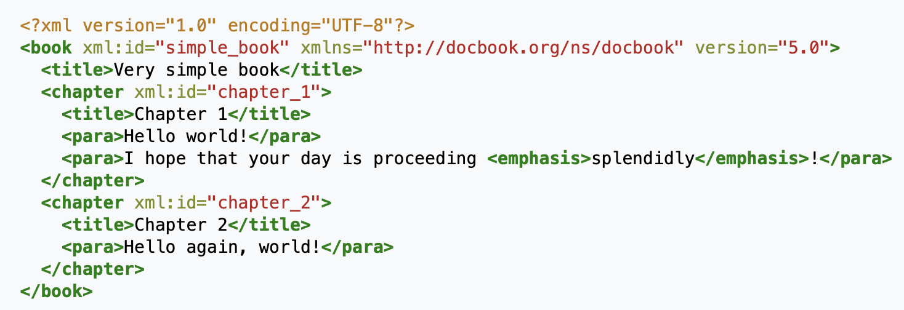

# Обзор по извлечению структуры из документов

Существует два типа структуры документов: физическая и логическая. 
Физическая структура документа связана с визуальным представлением документа, 
то есть как документ разбит на страницы, как страницы разбиты на блоки, блоки на текстовые строки (или изображения) и т. д.
Логическая структура документа предполагает извлечение структуры, осмысленной для данного типа документов.
Так, научные статьи делятся на секции, подсекции и т. д., которые, в свою очередь, могут иметь смысл (введение, список литературы) и делиться на части.

## 1. Обзор по форматам документов

**Сравнительная таблица по форматам документов**

| Название | Краткое описание | Основан на | Физическая структура | Логическая структура | Программная поддержка | Сложность | Читаемость |
|----------|------------------|:----------:|:--------------------:|:--------------------:|:---------------------:|:---------:|:----------:|
|[SGML](https://www.xmlgrrl.com/publications/DSDTD/ch01.html)| Разметка + DTD | - | - | + | есть (но формат устарел) | - | +- | 
|[DAFS](https://www.worldscientific.com/doi/abs/10.1142/9789812830968_0016)| Составлялся для результатов распознавания изображений документов| SGML | + | + | сейчас не используется | - | +- |
|[DocBook](http://www.cs.unibo.it/~cianca/wwwpages/dd/Docbook.pdf)| Для технической документации | SGML/XML | - | + | + | - | +- |
|DITA| Для объединения документов с разными DTD в один | XML | + | + | + | - | +- |
|HTML5|Язык для структурирования и представления содержимого всемирной паутины| SGML | + | + | + | +- | + |
|ALTO (+ METS)| Для хранения результатов OCR | XML | + | - | + | - | +-|
|TEI| Для семантики и логической структуры | XML | - | + | + | - | +- |
|SVG| Язык разметки масштабируемой векторной графики | XML | + | - | + | - | + |
|XSL-FO| Язык разметки типографских макетов | XSL | + | - | + | - | + |
|ODA| Объектно-ориентированный язык | - | + | + | - | - | +- |
|JSON| Лаконичный текстовый формат | - | - | + | + | - | +- |
|TeX| Система компьютерной вёрстки документов | - | + | + | + | +- | + |
|PDF| Для представления полиграфической продукции в электронном виде | - | + | - | - | +- | + |
|reStructuredText| Облегчённый язык разметки | - | +- | +- | + | + | + |
|Markdown| Облегчённый язык разметки | - | +- | +- | + | + | + |

#### SGML и основанные на нем форматы:

* [SGML](https://www.xmlgrrl.com/publications/DSDTD/ch01.html)
    
    Язык, использующий разметку (дополнительные аннотации в содержимом документа).
    В DTD (Document Type Definition) описан тип документа (для каждого типа документа в SGML есть свои правила разметки документов).
    SGML документ состоит из трех файлов: DTD, SGML объявление (описание символов, используемых в DTD и тексте документа),
    экземпляр документа (текст документа + ссылка на DTD).
    SGML - относительно простой стандарт, направленный на описание только логической структуры документа.
    
    \+ гибкость и расширяемость
    
    \+ много возможностей для программной обработки (но сложно обрабатывать)
    
    \- сложность
    
    Пример:
    

* [DAFS](https://www.worldscientific.com/doi/abs/10.1142/9789812830968_0016)
    
    Предназначен для представления изображений документов и результатов распознавания таких документов.
    Документ представляет собой иерархию вложенных друг в друга сущностей (документ, глава, блок), 
    при этом есть два дерева - для логической и физической структуры, листья деревьев с содержимым документа общие.

    У сущностей могут быть свойства. Пользователи могут добавлять свои сущности и свойства.
    Сущность может иметь несколько предков, поэтому структура документа может иметь несколько вариантов иерархии.
    Это может использоваться для представления логической и физической структуры,
    а также могут храниться альтернативные структуры (если структура извлекалась не со 100% точностью).
    
    \+ расширяемость
    
    \- мало кто умеет обрабатывать (сложность)
    

    
#### XML и основанные на нем форматы:

\+ гибкость и расширяемость
    
\+ интуитивно понятный формат
    
\+ обширная программная поддержка:

1) стандарты для конкретных доменов (XHTML, SVG, MathML, DocBook)
        
2) стандарты, связанные с xml:
    * XSLT - преобразование из одной xml-структуры в другую
    * XPath - навигация между конкретными элементами структуры
    * Namespaces - пространства имен, позволяют включать в один xml-файл другой

3) программные стандарты
    * DOM - представление xml в виде дерева (программное api)
    * SAX - api для доступа к xml с помощью функций

4) общие инструменты - парсеры на различных ЯП, конвертеры, редакторы, приложения для показа xml.

* [DocBook](http://www.cs.unibo.it/~cianca/wwwpages/dd/Docbook.pdf) 
(формат, разработанный в основном для технической документации).
Также может быть основан на SGML.

Пример из википедии:

* DITA (формат, предназначенный в основном для документов, разбитых на темы).
Согласно [Википедии](https://ru.wikipedia.org/wiki/DITA) это приложение XML, предназначенное 
для автоматизации сборки документов из разрозненных фрагментов, 
оформленных согласно соответствующим DTD, и их публикации в различных форматах.

* XHTML 2.0 (расширение html, позволяет добавлять секции и "грамматические" параграфы)

* BNML (Business Narrative Markup Language) (предназначем в основном для текстов законов и договоров)

* [eContracts TC](https://citeseerx.ist.psu.edu/viewdoc/download?doi=10.1.1.460.38&rep=rep1&type=pdf) (стандарт для договоров)

* [3 xml спецификации для представления документов](https://ieeexplore.ieee.org/abstract/document/4378679/) 

    1) ALTO - для физической структуры (страницы->текстовые блоки->текстовые строки->слова)
    
    2) TEI - для логической структуры  (рекурсивно вложенные друг в друга элементы div, семантический смысл указан в атрибутах)
    
    3) METS - для отображения между физической и логической структурой.

* SVG
    
    Для описания двухмерной векторной и смешанной векторно-растровой графики.
    Частный случай xml-формата. Предназначен для описания графического представления документа.
    
    \+ программно обрабатываеый (как и xml)
    
    \- низкоуровневый, сложно обрабатывать большое количество атрибутов для промежуточного представления.

* XSL-FO

    Для описания документов, разбитых на страницы.
    Частный случай xml-формата. Предназначен для описания графического представления документа.
    
    \+ надежная и строгая спецификация
    
    \- слишком большая спецификация (сложно реализовать всё)
    
* [TETML](https://www.pdflib.com/fileadmin/pdflib/pdf/manuals/TET-5.0-manual.pdf)
Файл, получающийся на выходе Text and Image Extraction Toolkit при обработке PDF.
Описывает физическую структуру документа. Есть возможность перевести в xml с помощью XSLT.
Есть программная поддержка.

#### ODA

Объектно-ориентированный язык, более сложный, чем SGML, так как помимо логической структуры
он описывает также геометрическую структуру и представление документа (как он отображается).
ODA-документ состоит из 6 частей: Logical View (логическая структура), Layout View (геометрическая структура),
Logical and Layout Generic Structures (описывают класс документа), Content Information (текст документа + изображения),
Styles (стили), Document Profile (имя автора, дата создания и т.д.).

Логическая структура (special logical structure) - иерархическая объектная модель:
корень содержит сложные или базовые логические объекты (могут быть именованными).
Базовые логические объекты могут содержать текст и графику.

Физическая структура (special layout structure):
набор страниц, составная и базовая страница, фрейм, блок.

Содержимое из логической структуры связывается с объектами физической структуры.

Тип документа может быть описан с помощью структуры (наподобие DTD) generic logical structure.

\- очень сложный и большой по размеру стандарт

\- мало кто умеет обрабатывать

#### Легковесные языки разметки

* [reStructuredText](https://docutils.sourceforge.io/docs/ref/rst/restructuredtext.html)
Облегчённый язык разметки. Хорошо применим для создания простых веб-страниц и других документов,
а также в качестве вспомогательного языка при написании комментариев в программном коде. 

* [Markdown](https://ru.wikipedia.org/wiki/Markdown) 
Облегчённый язык разметки, созданный с целью обозначения форматирования в простом тексте, 
с максимальным сохранением его читаемости человеком, и пригодный для машинного преобразования в языки для продвинутых публикаций (HTML, Rich Text и других).

#### Resource Description Framework 
Модель для представления данных, в особенности — метаданных. 
RDF представляет утверждения о ресурсах в виде, пригодном для машинной обработки. 
RDF является частью концепции семантической паутины.
Ресурсом в RDF может быть любая сущность. Утверждение, высказываемое о ресурсе, 
имеет вид «субъект — предикат — объект» и называется триплетом. 
Утверждение «небо голубого цвета» в RDF-терминологии можно представить
следующим образом: субъект — «небо», предикат — «имеет цвет», объект — «голубой». 
Для обозначения субъектов, отношений и объектов в RDF используются URI.
Множество RDF-утверждений образует ориентированный граф, 
в котором вершинами являются субъекты и объекты, а рёбра отображают отношения.
RDF сам по себе является не форматом файла, а только лишь абстрактной моделью данных,
то есть описывает предлагаемую структуру, способы обработки и интерпретации данных. Для хранения и передачи информации, уложенной в модель RDF, существует целый ряд форматов записи.

## 2. Обзор по представлениям структуры документов

Здесь описаны различные точки зрения на то, в каком виде можно представлять документ.

#### Представление структуры документа в виде дерева

Дерево помогает получить представление документа в виде иерархической структуры, 
то есть документ разбивается на последовательность вложенных друг в друга элементов.

* [DESCRIBNG DOCUMENTS AND EXPRESSING DOCUMENT STRUCTURE (2010)](https://patentimages.storage.googleapis.com/f6/24/63/5ccbd8902194dd/US7650340.pdf)
    
    Патент: предлагается представление документов любого типа в виде xml-дерева,
    узлы которого имеют семантический смысл. Кроме документов представлены изображения, музыка и т.д.
    
    Пример файла для документа:
    

* [STRUCTURE EXTRACTION ON ELECTRONIC DOCUMENTS (2001)](https://patentimages.storage.googleapis.com/pdfs/US6298357.pdf)

    Патент: предлагается структурированное представление электронного документа в виде дерева, 
    элементами которого являются группы параграфов со схожими визуальными признаками (атрибутами).
    Если в документе присутствует информация о его визуальном представлении,
    система собирает эту информацию в специальной таблице тегов и использует ее для построения структурированного документа.
    
    1) Система выделяет структурные типы (heading, list, footnote etc.), которые удается распознать.
    Структурные типы распознаются с помощью специальных правил (и собранной статистики).
    
    2) Каждому структурному типу присваивается уровень (с помощью методов сортировки).
    Для сортировки применяются специальные компараторы на основе правил (используется текст элемента, размер шрифта и т. д.).
    
    3) На основе выделенных элементов со структурными типами и уровнями строится дерево.

    
    
    На картинке:
    
    c1, c2, c3 - главы;
    
    a1 - приложение (appendix);
    
    s1, s2 - секции;
    
    pi - параграфы.
    
    У обычного параграфа уровень 0. При построении дерева система читает последовательно параграфы исходного документа.
    Если это обычный параграф (уровень 0), система добавляет этот параграф к уровню, на анализе которого она находится в данный момент.
    Содержимое параграфов помещается в листовые вершины.
    
    Если уровень не ноль и меньше текущего, идем вверх по иерархии пока не сравняемся с текущим и добавляем новый узел (ветка-секция).
    Иначе просто добавляем новый узел.
    Ветки могут преставлять lists, chapters, sections, subsections, foot notes.
    
    Количество уровней структуры можно задать вручную.

#### Представление структуры документа в виде графа

Дерево - частный случай графа. Произвольный граф позволяет представить 
разбиение документа на части (каждая часть является вершиной графа), а также описать порядок чтения частей
(ребра графа могут быть помечены и описывать тип взаимоотношений между частями документа).
Структура докумета при этом может получиться не обязательно иерархической.

* [Machine Learning for Document Structure Recognition (2011)](https://www.researchgate.net/profile/Gerhard_Paass/publication/265487498_Machine_Learning_for_Document_Structure_Recognition/links/54eb94410cf2ff89649df937.pdf)

    Представление документа (газета со статьями) в виде графа:
    
    
    
    Помимо сегментации в документе определяется порядок чтения.
    
* [Document Structure and Layout Analysis (2007)](http://citeseerx.ist.psu.edu/viewdoc/download?doi=10.1.1.104.1887&rep=rep1&type=pdf)

    Представление документа в виде упорядоченного графа с атрибутами:
    
    Вершины графа соответсвуют регионам документа, ребра соответсвуют отношениям между различными регионами.
    
    Для каждого ребра указан атрибут - тип отношения между регионами, в вершинах графа также указаны атрибуты - свойства регионов (тип, размер, расположение)
    
    Однако из-за неоднозначности атрибутов используют attributed random graphs (случайные графы с атрибутами).
    В таких графах атрибуты параметризованы параметрами из какого-либо распределения.
    
    Если такой граф сделать корневым деревом - получится вариант представления иерархической структуры документа.
    

#### Представление структуры документа с использованием формальных грамматик

Документ может быть представлен последовательностью правил, 
которые необходимо обработать с помощью специального парсера.
В результате такой обработки получается исходный документ.

* [Document Structure and Layout Analysis (2007)](http://citeseerx.ist.psu.edu/viewdoc/download?doi=10.1.1.104.1887&rep=rep1&type=pdf)
    
    Документ представляется в виде последовательности терминальных символов (пиксели, символы, регионы и т. д.)

    Грамматика позволяет из стартового символа вывести множество терминальных символов, которое представляет собой документ.
    
    Грамматики ограничивают набор правил, которые могут использоваться.
    
    В грамматике используются нетерминальные символы, которые могут представлять собой 
    физические регионы документа, например, текстовые регионы, колонки, строки, 
    структурные единицы, например, хедеры, футеры, заголовки таблиц и рисунков и т. д.
    
    Пример представления документа в виде формальной грамматики:
    
    
    
    Может существовать несколько способов вывода документа для данной последовательности терминальных символов.
    Стохастическая грамматика - грамматика, в которой каждому правилу вывода приписана вероятность его применения.

#### Представление структуры документа в виде зон и логических меток

Документ может быть представлен как плоская структура: последовательность частей какого-либо типа.
Такими частями могут быть страницы, текстовые блоки, строки, слова, символы и т. д. 
Эти части могут описывать документ в физическом смысле или в логическом. Для представления всей структуры 
может быть установлена взаимосвязь логических блоков документа с геометрическими.
Другой подход: документ можно разбить на физические блоки, каждому блоку можно назначить семантическую метку
(таким образом получим логическую структуру). К такому подходу можно отнести задачу сегментации документа.
