# Обзор по извлечению структуры из документов

* Структура документа и способы ее представления.
* Извлечение иерархической логической структуры из текстовых документов в формате docx.

Существует два типа структуры документов: физическая и логическая. 
Физическая структура документа связана с визуальным представлением документа, 
то есть как документ разбит на страницы, как страницы разбиты на блоки, блоки на текстовые строки (или изображения) и т. д.
Логическая структура документа предполагает извлечение структуры, осмысленной для данного типа документов.
Так, научные статьи делятся на секции, подсекции и т. д., которые, в свою очередь, могут иметь смысл (введение, список литературы) и делиться на части.

Разные форматы для хранения текстовых документов разрабатывались для разных целей.
Рассмотрим некоторые из форматов, которые использовались и используются для хранения 
и представления логической и физической структуры документа.

## 1. Обзор по форматам документов

**Сравнительная таблица по форматам документов**

| Название | Основная цель | Основан на | Физическая структура | Логическая структура | Программная поддержка | Сложность | Читаемость |
|:--------:|:-------------:|:----------:|:--------------------:|:--------------------:|:---------------------:|:---------:|:----------:|
|[SGML](https://www.xmlgrrl.com/publications/DSDTD/ch01.html)| Для совместного использования машинно-читаемых документов в больших проектах | GML | - | + | Есть (но формат устарел) | - | +- | 
|[DAFS](https://www.worldscientific.com/doi/abs/10.1142/9789812830968_0016)| Для результатов распознавания изображений документов| SGML | Дерево физической структуры | Дерево логической структуры | Сейчас не используется, скорее всего нет | Много сложных понятий | Вряд ли легко воспринимать, но примеров представления не найдено |
|[DocBook](http://www.cs.unibo.it/~cianca/wwwpages/dd/Docbook.pdf)| Для технической документации | SGML/XML | - | + | + | - | +- |
|DITA| Для объединения документов с разными DTD в один | XML | + | + | + | - | +- |
|HTML5|Язык для структурирования и представления содержимого всемирной паутины| SGML | + | + | + | +- | + |
|ALTO (+ METS)| Для хранения результатов OCR | XML | + | - | + | - | +-|
|TEI [(TEI Lite)](https://tei-c.org/release/doc/tei-p5-exemplars/pdf/tei_lite.doc.pdf)| Для семантики и логической структуры | XML | +- | + | + | - | +- |
|ODA| Объектно-ориентированный язык | - | + | + | - | - | +- |
|reStructuredText| Облегчённый язык разметки | Structured Text and Setext | +- | +- | + | + | + |
|Markdown| Облегчённый язык разметки | Text E-mail conventions | +- | +- | + | + | + |
|JSON| Лаконичный текстовый формат | - | - | + | + | - | - |
|TeX| Система компьютерной вёрстки документов | - | + | + | + | +- | + |
|Office Open XML|Для хранения электронных документов пакетов офисных приложений |XML| + | +- | +- | - | + |
|PDF| Для представления полиграфической продукции в электронном виде | - | + | - | - | +- | + |

#### SGML и основанные на нем форматы:

* [SGML](https://www.xmlgrrl.com/publications/DSDTD/ch01.html)
    
Язык, использующий разметку (дополнительные аннотации в содержимом документа).
Стандартизован ISO в 1986 году.

SGML документ состоит из трех файлов: 
1) DTD (определение типа документа), 
2) SGML декларация (описание символов, используемых в DTD и тексте документа),
3) экземпляр документа (текст документа + ссылка на DTD).

SGML предназначался для описания только логической структуры документа.

[Основные особенности SGML](http://nknaromanova.narod.ru/sgml.htm):
1) **Описательная разметка.**
Система описательной разметки использует коды разметки, просто предоставляющие названия для классификации частей документа.
При описательной, а не процедурной, разметке один и тот же документ можно обрабатывать различными программами, 
каждая из которых может применять различные правила обработки к тем частям документа, которые она считает важными. 
2) **Типы документов.**
SGML вводит понятие типа документа и, как следствие, определения типа документа (document type definition, DTD). 
Тип документа формально определяется его составными частями и их структурой.
Раз документы имеют известные типы, можно использовать специальную программу, 
называющуюся анализатором (parser), для проверки документа, утверждающего свою принадлежность определенному типу. 
Анализатор проверяет, что все элементы, требуемые типом документа, на самом деле присутствуют и расположены в правильном порядке. 
Что более важно, разные документы одного и того же типа могут обрабатываться одинаковым образом.
3) **Независимость данных.**
Основная цель создания SGML заключалась в том, чтобы обеспечить транспортабельность закодированных документов из одной аппаратной и программной среды в другую без потери информации.
Два описанных выше свойства решают эту задачу на абстрактном уровне; третье свойство - на уровне строк байтов (символов), из которых составляется документ. 
SGML предоставляет универсальный механизм строковой подстановки (string substitution), то есть, простой машинно-независимый способ обозначить, что некоторая последовательность символов в документе должна заменяться при его обработке некоторой другой последовательностью.

\+ гибкость и расширяемость

\+ много возможностей для программной обработки (но сложно обрабатывать)

\- сложность

Пример:
    
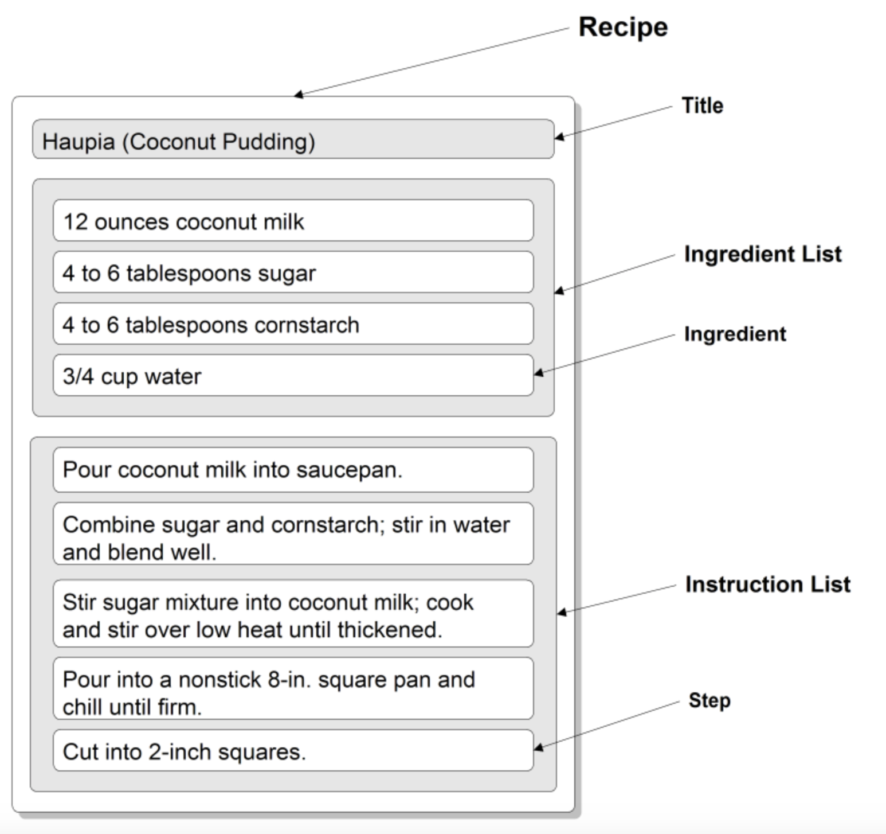
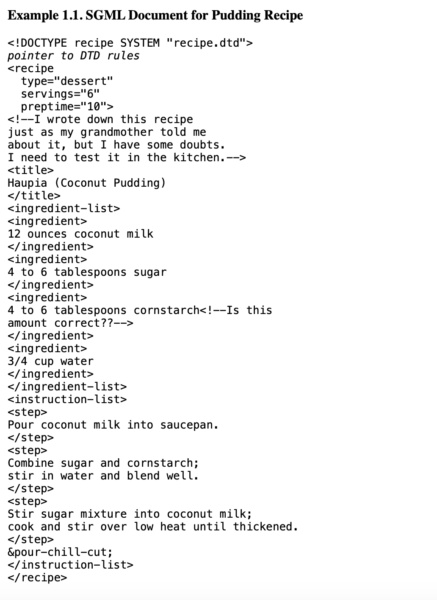
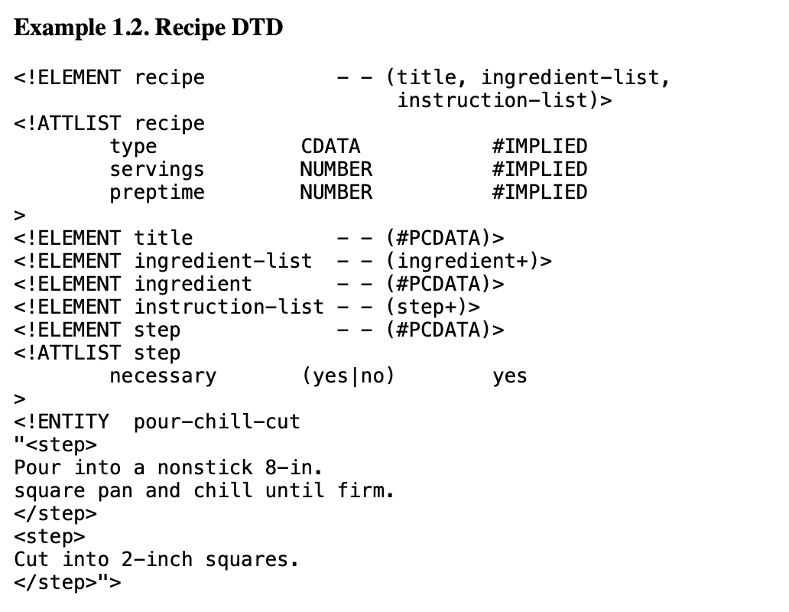

* [DAFS](https://www.worldscientific.com/doi/abs/10.1142/9789812830968_0016)
    
Предназначен для представления изображений документов и результатов распознавания таких документов.
DAFS за основу берет SGML, однако расширяет его, позволяя хранить не только логическую структуру.
Документ представляет собой иерархию вложенных друг в друга сущностей (документ, глава, блок), 
при этом есть два дерева - для логической и физической структуры, листья деревьев с содержимым документа общие.

У сущностей могут быть свойства. Пользователи могут добавлять свои сущности и свойства.
Сущность может иметь несколько предков, поэтому структура документа может иметь несколько вариантов иерархии.
Это может использоваться для представления логической и физической структуры,
а также могут храниться альтернативные структуры (если структура извлекалась не со 100% точностью).
В [статье](http://citeseerx.ist.psu.edu/viewdoc/download?doi=10.1.1.448.9716&rep=rep1&type=pdf#page=105) 
говорится, что есть библиотека на си DAFSLib для работы с документами DAFS.
Однако найти стандарт и библиотеку не удалось, возможно оттого, что DAFS мало где использовался.

\+ расширяемость

\- мало кто умеет обрабатывать (сложность)
    
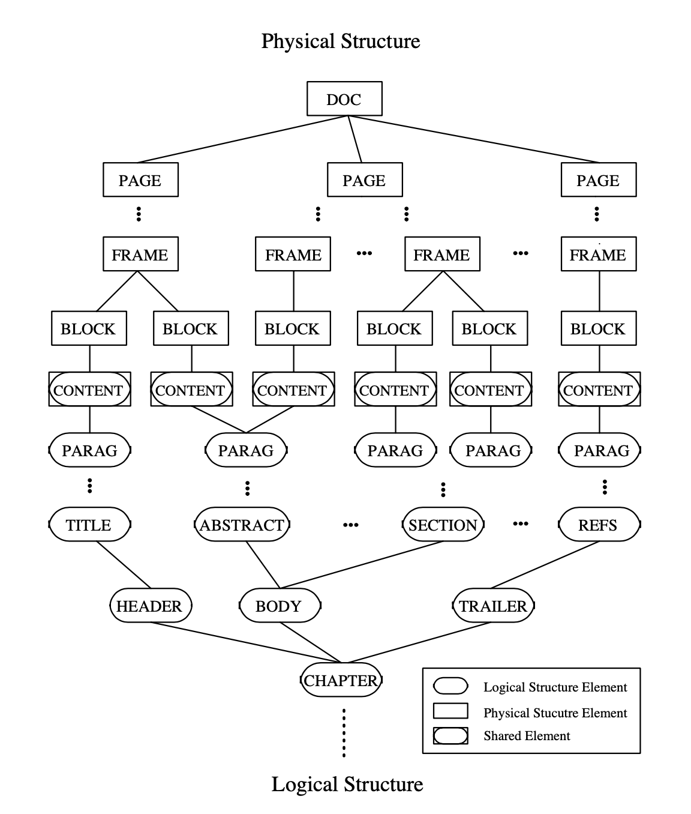
    
#### XML и основанные на нем форматы:

Основное различие между SGML и XML версиями состоит в следующем (применимо для всех XML — приложений):
* XML элементы должны быть всегда закрыты.
* XML элементы должны иметь правильную вложенность.
* значения атрибутов должны быть обязательно в кавычках.

\+ гибкость и расширяемость
    
\+ интуитивно понятный формат
    
\+ обширная программная поддержка:

1) стандарты для конкретных доменов (XHTML, SVG, MathML, DocBook)
        
2) стандарты, связанные с xml:
    * XSLT - преобразование из одной xml-структуры в другую
    * XPath - навигация между конкретными элементами структуры
    * Namespaces - пространства имен, позволяют включать в один xml-файл другой

3) программные стандарты
    * DOM - представление xml в виде дерева (программное api)
    * SAX - api для доступа к xml с помощью функций

4) общие инструменты - парсеры на различных ЯП, конвертеры, редакторы, приложения для показа xml.

* [DocBook](http://www.cs.unibo.it/~cianca/wwwpages/dd/Docbook.pdf) 
(формат, разработанный в основном для технической документации).
[Русская документация](http://lib.custis.ru/SGML_Docbook)
Также может быть основан на SGML.

    Элементы Docbook можно разделить на
    * структурные - книги, разделы, секции и т. п.
    * блочные - различные списки и параграфы.
    * строчные - форматирование внутристрочных элементов.
    * метаэлементы - вспомогательные метаэлементы, «атрибутирующие» другие элементы. В версии Docbookа 5.0, все такие элементы должны содержаться в метаэлементе «info»
    
    Вложенность структурных элементов удобно наблюдать на следующей (гипертекстовой) диаграмме: 
    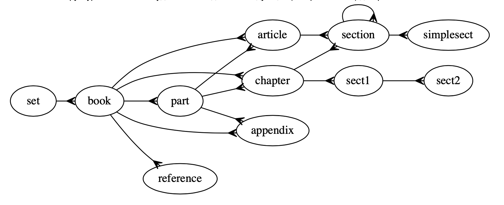

    * set - Самый верхний элемент docbook. Он может включать две или более связанных book, которые могут содержать ссылки («xref», «link») друг на друга (например, комплект документации по программному продукту, включающему «техническое задание», «руководство пользователя», «руководство системного администратора» и «руководство программиста»).
    * book - «Книга» — наиболее распространенный корневой элемент.
    * part - Раздел уровня выше чем глава.
    * reference - Справочник, т. е. набор справочных статей (вида «Unix Man» статей).
    * article - Статья общего вида (конкретный тип статьи специфицируется с помощью атрибутов).
    * chapter - Глава (верхнего уровня). Обязательно должен быть между «book» и «section».
    * section - Раздел. Разделы можно неограничено и гибко вкладывать друг в друга с помощью «section», либо использовать вложение элементов-разделов фиксированных уровней:
    
    sect1 / sect2 / sect3 / sect4 / sect5
    * simplesect - Терминальный (листовой) раздел. Раздел этого уровня не должен попадать в «Содержание» (Table of Contents).

Пример из википедии:
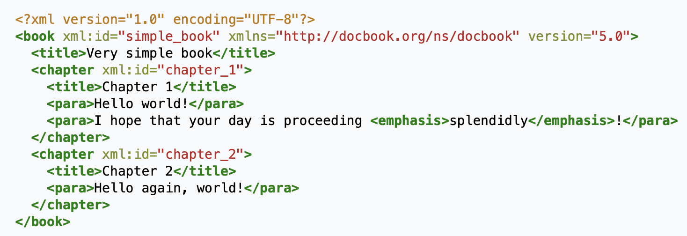

* DITA (формат, предназначенный в основном для документов, разбитых на темы).
Согласно [Википедии](https://ru.wikipedia.org/wiki/DITA) это приложение XML, предназначенное 
для автоматизации сборки документов из разрозненных фрагментов, 
оформленных согласно соответствующим DTD, и их публикации в различных форматах.

* XHTML 2.0 (расширение html, позволяет добавлять секции и "грамматические" параграфы)

* BNML (Business Narrative Markup Language) (предназначем в основном для текстов законов и договоров)

* [eContracts TC](https://citeseerx.ist.psu.edu/viewdoc/download?doi=10.1.1.460.38&rep=rep1&type=pdf) (стандарт для договоров)

* ALTO - для физической структуры (страницы->текстовые блоки->текстовые строки->слова)
    
* TEI - для логической структуры  (рекурсивно вложенные друг в друга элементы div, семантический смысл указан в атрибутах)
    
    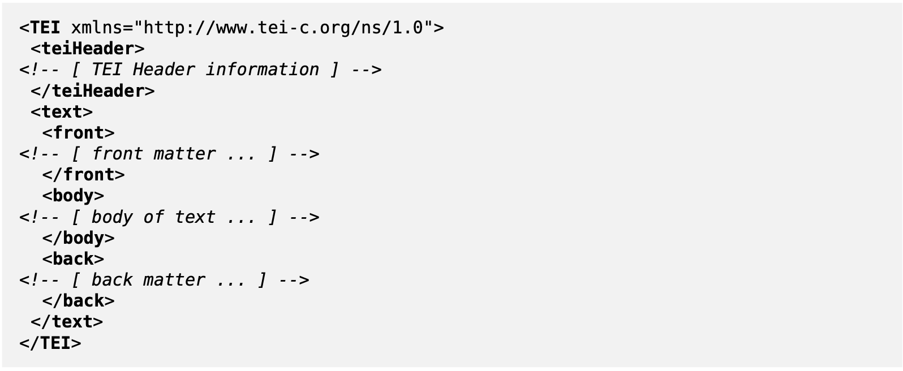
    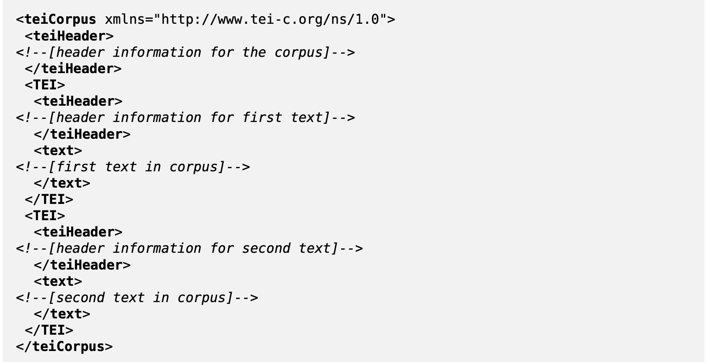
    
    **Основные теги:**
    * TEI - внутри этого тега помещен правильный TEI-документ с одним teiHeader и одним text
    * teiHeader - описывает метаданные документа
    * text - описывает текст или набор текстов, состоит из front, body (или group of text), back.
    front, back - опционально.
    * teiCorpus - набор документов, содержит один teiHeader и один (или более) элемент TEI
    * front - начало текста (заголовок или какое-либо другое начало документа/текста перед основным телом)
    * group - группа элементов text
    * body - тело документа/текста
    * back - конец текста (приложение или какое-либо другое окончание документа после основного тела)
    * p - основная единица текста (параграф)
    * div - какая-то осмысленная структурная единица текста (имеет атрибут type), может иметь вложенные div.
    Опционально может иметь head, trailer.
    * head - какое-то начало div
    * trailer - какое-то окончание div
    * \<hi rend="italic"/> - для визуально выделенных слов (шрифт, цвет, начертание, размер, выравнивание)
    атрибут rend можно добавлять к любому тегу.
    * table, row, cell - таблицы (внутри параграфов)
    * list, item - списки (внутри параграфов)
    
* METS - для отображения между физической и логической структурой.

* SVG
    
    Для описания двухмерной векторной и смешанной векторно-растровой графики.
    Частный случай xml-формата. Предназначен для описания графического представления документа.
    
    \+ программно обрабатываеый (как и xml)
    
    \- низкоуровневый, сложно обрабатывать большое количество атрибутов для промежуточного представления.

* XSL-FO

    Для описания документов, разбитых на страницы.
    Частный случай xml-формата. Предназначен для описания графического представления документа.
    
    \+ надежная и строгая спецификация
    
    \- слишком большая спецификация (сложно реализовать всё)

#### ODA

Объектно-ориентированный язык, более сложный, чем SGML, так как помимо логической структуры
он описывает также геометрическую структуру и представление документа (как он отображается).
ODA-документ состоит из 6 частей: Logical View (логическая структура), Layout View (геометрическая структура),
Logical and Layout Generic Structures (описывают класс документа), Content Information (текст документа + изображения),
Styles (стили), Document Profile (имя автора, дата создания и т.д.).

Логическая структура (special logical structure) - иерархическая объектная модель:
корень содержит сложные или базовые логические объекты (могут быть именованными).
Базовые логические объекты могут содержать текст и графику.

Физическая структура (special layout structure):
набор страниц, составная и базовая страница, фрейм, блок.

Содержимое из логической структуры связывается с объектами физической структуры.

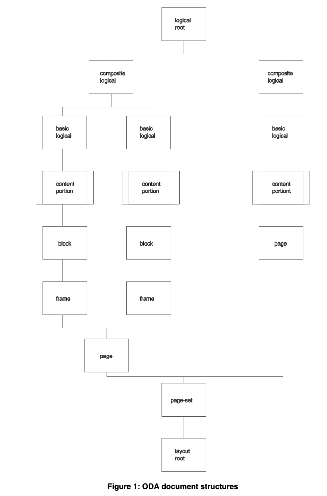

Тип документа может быть описан с помощью структуры (наподобие DTD) generic logical structure.

\- очень сложный и большой по размеру стандарт

\- мало кто умеет обрабатывать

#### Легковесные языки разметки

* [reStructuredText](https://docutils.sourceforge.io/docs/ref/rst/restructuredtext.html)
Облегчённый язык разметки. Хорошо применим для создания простых веб-страниц и других документов,
а также в качестве вспомогательного языка при написании комментариев в программном коде. 

* [Markdown](https://ru.wikipedia.org/wiki/Markdown) 
Облегчённый язык разметки, созданный с целью обозначения форматирования в простом тексте, 
с максимальным сохранением его читаемости человеком, и пригодный для машинного преобразования в языки для продвинутых публикаций (HTML, Rich Text и других).

#### Что еще можно использовать для структурирования информации

* TeX

* JSON

#### Форматы для визуального представления документа

* Office Open XML

* PDF

## 2. Обзор по представлениям структуры документов

Здесь описаны различные точки зрения на то, в каком виде можно представлять документ.

#### Представление структуры документа в виде дерева

Дерево помогает получить представление документа в виде иерархической структуры, 
то есть документ разбивается на последовательность вложенных друг в друга элементов.

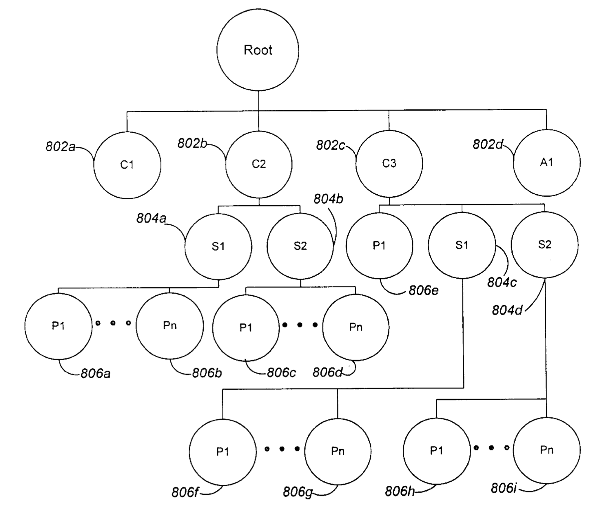

* [DESCRIBNG DOCUMENTS AND EXPRESSING DOCUMENT STRUCTURE (2010)](https://patentimages.storage.googleapis.com/f6/24/63/5ccbd8902194dd/US7650340.pdf)

* [STRUCTURE EXTRACTION ON ELECTRONIC DOCUMENTS (2001)](https://patentimages.storage.googleapis.com/pdfs/US6298357.pdf)

#### Представление структуры документа в виде графа

Дерево - частный случай графа. Произвольный граф позволяет представить 
разбиение документа на части (каждая часть является вершиной графа), а также описать порядок чтения частей
(ребра графа могут быть помечены и описывать тип взаимоотношений между частями документа).
Структура докумета при этом может получиться не обязательно иерархической.
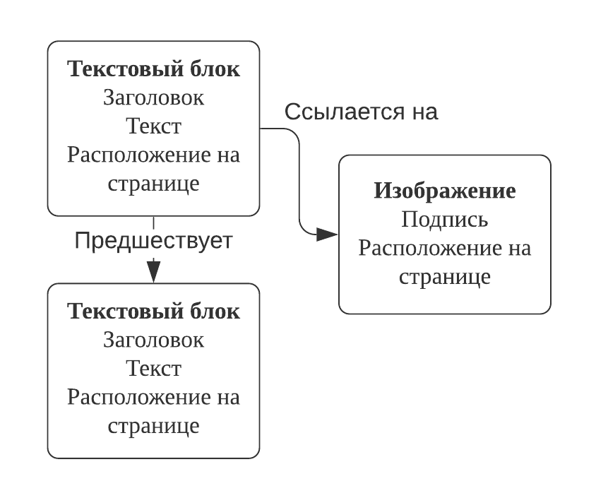    

* [Machine Learning for Document Structure Recognition (2011)](https://www.researchgate.net/profile/Gerhard_Paass/publication/265487498_Machine_Learning_for_Document_Structure_Recognition/links/54eb94410cf2ff89649df937.pdf)
 
* [Document Structure and Layout Analysis (2007)](http://citeseerx.ist.psu.edu/viewdoc/download?doi=10.1.1.104.1887&rep=rep1&type=pdf)

#### Представление структуры документа с использованием формальных грамматик

Документ может быть представлен последовательностью правил, 
которые необходимо обработать с помощью специального парсера.
В результате такой обработки получается исходный документ.
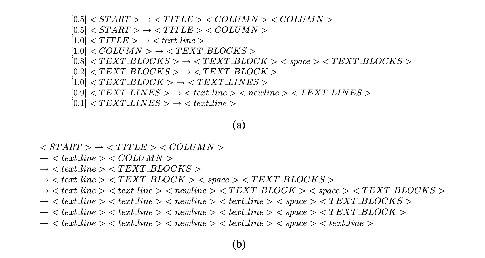

* [Document Structure and Layout Analysis (2007)](http://citeseerx.ist.psu.edu/viewdoc/download?doi=10.1.1.104.1887&rep=rep1&type=pdf)

#### Представление структуры документа в виде зон и логических меток

Документ может быть представлен как плоская структура: последовательность частей какого-либо типа.
Такими частями могут быть страницы, текстовые блоки, строки, слова, символы и т. д. 
Эти части могут описывать документ в физическом смысле или в логическом. Для представления всей структуры 
может быть установлена взаимосвязь логических блоков документа с геометрическими.
Другой подход: документ можно разбить на физические блоки, каждому блоку можно назначить семантическую метку
(таким образом получим логическую структуру). К такому подходу можно отнести задачу сегментации документа.
