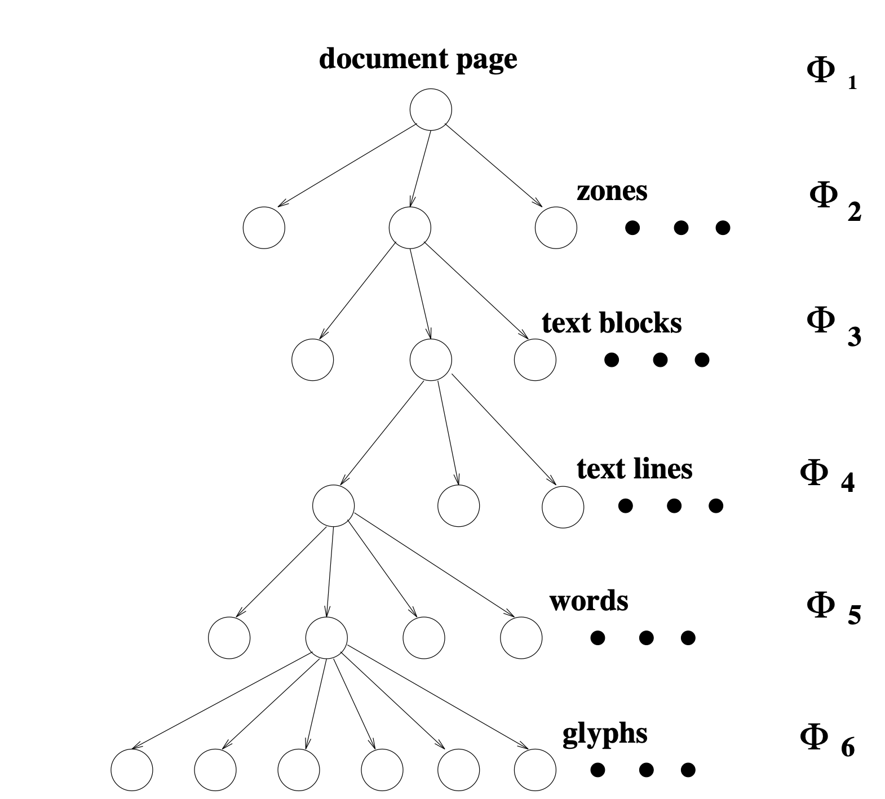
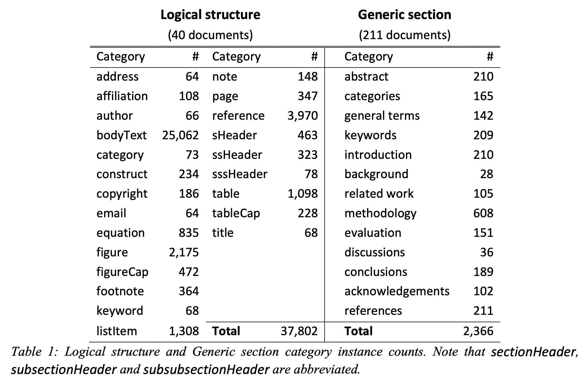
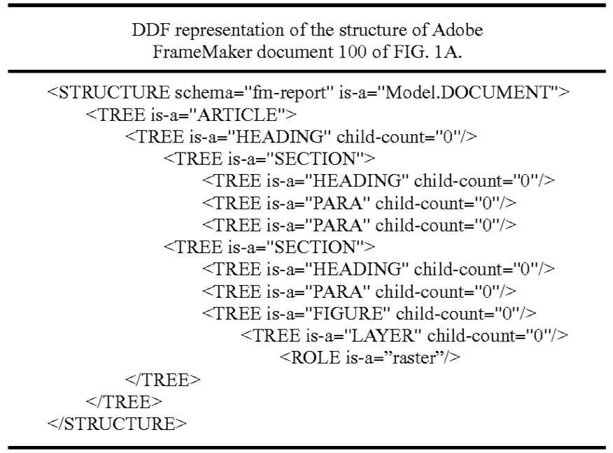

# Обзор возможной структуры документов

### Статьи

* [Text Type Structure and Logical Document Structure (2004)](https://ids-pub.bsz-bw.de/frontdoor/deliver/index/docId/9/file/Langer_Luengen_Bayerl_Towards_automatic_annotation_of_type_structure_2004.pdf)

Основная цель - не извлечение логической структуры, а разбиение документа по темам. 

Структура документов уже проаннотирована: научные статьи представлены в виде xml (например, на параграфы, секции, приложения)

Структура xml основана на специальном стандарте [DocBook standard (1999)](http://www.cs.unibo.it/~cianca/wwwpages/dd/Docbook.pdf), предназначенного в основном для написания технической литературы

Структура состоит из элементов, атрибутов и сущностей. Элементы представлены тегами, элементы могут включать атрибуты, сущности - это какие-то именованные данные, на которые можно ссылаться.
Всё очень похоже на html или xml, но SGML/XML убирает всю неоднозначность и явно всегда прописывает структуру (например заголовок секции явно будет прописан)

Основые особенности: ясность, структурированность (третий уровень секции не может идти сразу после первого), plain text (совместимость с разными платформами)

* [Basic Research in Computer Science: Document Structure Description (2000)](https://www.brics.dk/NS/00/7/BRICS-NS-00-7.pdf)

* [Document Structure (2003)](https://www.mitpressjournals.org/doi/pdfplus/10.1162/089120103322145315)

Помимо "физической" структуры документа (авторы предполагают иерархическую структуру) выделяют еще абстрактную структуру

Генерируют тексты. Структура документа предполагает наличие 6 уровней:

0 text-phrase
1 text-clause
2 text-sentence
3 paragraph
4 section
5 chapter

Абстрактная структура (rhetorical structure), которая предлагается, основана да сущностях и взаимоотношениях между ними (неупорядоченное дерево)

Учитывается смысл текста, то есть структура помогает определить еще и взаимосвязь частей предложения

* [Document Structure Analysis Algorithms: A Literature Survey (2003)](http://kanungo.com/pubs/spie03-layoutsurvey.pdf)

#### Обзор различных подходов и алгоритмов по извлечению логической структуры (уже довольно старый)

1) Документ может быть представлен как набор его физических компонент с метками (символы, слова, предложения, таблицы, графики и т. д.), то есть в виде плоской структуры

2) Для представления семантических связей между логическими компонентами (заголовок, авторы, секции и т. д.) может использоваться дерево

3) Краткое описание некоторых работ:

    * [Understanding multi-articled documents (1990)](https://ieeexplore.ieee.org/abstract/document/118163/) - "физическое" дерево (head, body) -> "логическое" дерево (title, abstract, sub-title, paragraph, header, footer, page number, caption)
    
    * A model based layout understanding method for the document recognition system (1991) - дерево, содержащее информацию о взаимном расположении объектов в документе
    
    * Logical structure descriptions of segmented document images (1991) - Превращение физической структуры в логическую на основе правил 
    
    * A top-down document analysis method for logical structure recognition (1991) - Используется формальное описание возможных классов документов.
    Это описание включает в себя правила композиции (общая логическая структура, описанная в форме Бэкуса-Наура) и правила представления (физические свойства логических сущностей).
    Описание документа - это граф, в вершинах которого находятся метки типов логических сущностей, которые необходимо распознать.
    Анализ документа подразумевает находжение пути в таком графе (при условии, что документ имеет структуру, подразумеваемую таким графом).
    
    * Modeling documents for structure recognition using generalized n-gram (1997) - Структура в виде дерева.
    Метод похож на n-граммы, основан на статистическом представлении образцов документов.
    Среди возможных деревьев выбирается наиболее близкое к выученной модели (модель учится на примерах).
    
    * Page grammars and page parsing: A syntatic approach to document layout recognition (1993) - Физическая и логическая структура документов.
    Физическая описана с помощью набора правил грамматики, определяемых соседними сущностями. Логическая структура описана контекстно-свободной грамматикой.
    
    * [Automatic Discovery of Logical Document Structure (1998)](https://ecommons.cornell.edu/bitstream/handle/1813/7352/98-1698.pdf;sequence=1)
    [Near-wordless document structure classification (1995)](http://www.cs.cornell.edu/info/people/summers/Papers/classify.ps) (тот же автор).
    Описан алгоритм автоматического вывода логической структуры документа из общей физической структуры.
    Для каждой логической метки описаны физические прототипы и 
    логическая структура извлекается путем измерения специальной метрики между физическими сегментами документа и предописанными прототипами.

Описаны метрики, с помощью оценивали качество систем.

Очень хорошая сравнительная таблица:

* [Use of document structure analysis to retrieve information from documents in digital libraries (1997)](http://citeseerx.ist.psu.edu/viewdoc/download?doi=10.1.1.55.473&rep=rep1&type=pdf)

DeLoS - document logical structure derivation system

Выделение структуры применяется для отобранных по запросу документов с целью дальнейшего выделения нужных логических компонентов
(при поиске по документам нам не нужен весь документ, а только конкретные его части)

DeLoS - специальная система, которая обрабатывает документы в виде изображений, на выходе выдает страницы, разбитые на блоки.
Помеченные блоки объединяются в смысловые части, которые выстраиваются в порядке чтения.

layout analysis (извлечение синтаксической структуры) -> извлечение логической структуры:

получается иерархический индекс из логических частей (units) с информацией об их типах, относительном расположениии и их компонентах

типы логических компонентов: газетная статья, лист цитирований, фотография, график и т. д.

Информация о физической и логической структуре документов разных типов представлялась в виде базы знаний.

* [Document Structure Analysis and Performance Evaluation (1999)](http://citeseerx.ist.psu.edu/viewdoc/download?doi=10.1.1.50.8068&rep=rep1&type=pdf)

Вероятностный подход (используются вертикальные и горизонтальные проекции ббоксов - профиль сумм проекций)

Извлекаемая структура:

Пайплайн:

1) Разделение текст/не текст

2) Извлечение текстовых строк

3) Извлечение текстовых колонок

4) Извлечение текстовых блоков

5) Присвоение меток текстовым блокам

Информация в размеченных данных:

1) Схема (layout): иерархия ббоксов страницы, хедера, футера, текстовых и нетекстовых зон, текстовых строк, слов

2) Логическая структура: метка типа контента для каждой зоны; порядок чтения для текстовой и нетекстовой зоны, текстовых строк и слов

3) Текстовое содержимое каждой текстовой зоны

4) Стиль - некоторые атрибуты страницы и зон

* [Document Structure and Layout Analysis (2007)](http://citeseerx.ist.psu.edu/viewdoc/download?doi=10.1.1.104.1887&rep=rep1&type=pdf)

Обзорная статья по анализу документов: рассматривает в общих чертах предобработку документов,
представление структуры документов, анализ разметки документов (сегментация), 
понимание структуры документов (присвоение меток физическим элементам документа),
оценка качества анализа документов, анализ рукописных документов.

##### 1) Представление документа в виде упорядоченного графа с атрибутами:

Вершины графа соответсвуют регионам документа, ребра соответсвуют отношениям между различными регионами.

Для каждого ребра указан атрибут - тип отношения между регионами, в вершинах графа также указаны атрибуты - свойства регионов (тип, размер, расположение)

Однако из-за неоднозначности атрибутов используют attributed random graphs (случайные графы с атрибутами).
В таких графах атрибуты параметризованы параметрами из какого-либо распределения.

Если такой граф сделать корневым деревом - получится вариант представления иерархической структуры документа.

##### 2) Представление документа с использованием формальных грамматик:

Документ представляется в виде последовательности терминальных символов (пиксели, символы, регионы и т. д.)

Грамматика позволяет из стартового символа вывести множество терминальных символов, которое представляет собой документ.

Грамматики ограничивают набор правил, которые могут использоваться.

В грамматике используются нетерминальные символы, которые могут представлять собой 
физические регионы документа, например, текстовые регионы, колонки, строки, 
структурные единицы, например, хедеры, футеры, заголовки таблиц и рисунков и т. д.

Пример представления документа в виде формальной грамматики:

Может существовать несколько способов вывода документа для данной последовательности терминальных символов.
Стохастическая грамматика - грамматика, в которой каждому правилу вывода приписана вероятность его применения.

Методы сегментации документов:

1) Сверху вниз

2) Снизу вверх

3) Смешанные методы

##### Примеры алгоритмов:

1) X-Y Cut (сверху вниз) - работа с проекциями регионов на горионтальную и вертикальную оси (большая чувствительность к поворотам).
Регионы разбиваются пока по определенному критерию не будет решено, что делить дальше некуда.

2) Геометрические подходы, основанные на анализе фона (сверху вниз).
Основная идея - захватить прямоугольники максимального размера, которые не содержат пикселей "переднего плана" (не фона).

3) Docstrum (снизу вверх) - алгоритм k ближайших соседей

4) Voronoi diagram based algorithm, run-length smearing algorithm  (снизу вверх)

##### Понимание структуры документов

Логические метки:
title, abstract, sub-title, paragraph, sentence, words, header, footer, caption, page number

Подходы к описанию логической структуры:

1) Приписывание набору регионов изображения какой-либо строки символов.

    * Специальная грамматика - анализ структуры вычисляет наиболее вероятный набор грамматических правил, который генерирует наблюдаемую строку символов.
    
    * Дерево или граф.
    
    * Метод, основанный на правилах.

2) Применение знаний о схеме и структуре документа, извлеченных с помощью методов OCR и распознавания графики.
Например, использование слов из строки, близкой к изображению, может помочь решить, является ли она подписью к рисунку.

* [Logical Structure Recovery in Scholarly Articles with Rich Document Features (2012)](https://nlp.stanford.edu/~lmthang/data/papers/ijdls-SectLabel.pdf)

Извлечение логической структуры документа (научных статей) с использованием не только текста документа, но и дополнительных метаданных:
размер текста и его расположение (позиция)

Две подзадачи в исследовании логической структуры:

1) Классификация логической структуры. (Logical structure) 
Документ рассматривается как последовательность строк, каждая из которых относится к одному из логических классов.

2) Классификация секций общего вида. (Generic Section) 
Рассматриваются заголовки секций, на основе которых извлекается логическая цель секции. 
(“5. Text Features” → Methodology)

Извлекаемая структура:

1) Logical structure: 23 категории - address, affiliation, author, bodyText, categories, construct, 
copyright, email, equation, figure, figureCaption, footnote, keywords, listItem, 
note, page, reference, sectionHeader, subsectionHeader, subsubsectionHeader, table, 
tableCaption, title. 
Используемые признаки - расположение строки, присутствие нумерации, пунктуация, длина строки в токенах.

2) Generic Section: 13 категорий - abstract, categories, general terms, keywords, introduction, 
background, related work, methodology, evaluation, discussion, conclusions, acknowledgments, references. 
Используемые признаки - позиция, первое и второе слово, весь заголовок.

Система может работать как с помощью OCR с изображениями, так и с сырым текстом.
Имеется открытый размеченный датасет.
Используются Условные случайные поля - conditional random fields (CRF).

Показано, как меняются macro-f1 и micro-f1 при добавлении графических признаков.

Извлекаемая логическая структура и назначения секций:

* [Learning to Extract Semantic Structure from Documents Using Multimodal Fully Convolutional Neural Networks (2017)](https://openaccess.thecvf.com/content_cvpr_2017/papers/Yang_Learning_to_Extract_CVPR_2017_paper.pdf)

Сверточная (мультимодальная) нейронная сеть для попиксельной сегментации документов.
Кроме графических признаков для сегментации дополнительно используются текстовые признаки:
с помощью методов OCR извлекается текст, каждое слово кодируется вектором, 
предложения кодируются как среднее арифметическое векторов слов. 
Между пикселями и баундин боксами предложений устанавливается соответствие. 
К графическим признакам для каждого пикселя добавляются полученные векторы для предложений.
Создают синтетический корпус данных для тренировки нейросети.

Выделяют следующие типы регионов: figure, table, section heading, caption, list, paragraph.

Сеть состоит из 4 частей:

1) энкодер (извлекает графические признаки)

2) декодер (выдает сегментированное изображение)

3) дополнительный декодер (для "реконструкции" документов)

4) "мост" (для объединения текстовых и графических признаков).

* [Document Structure Extraction using Prior based High Resolution Hierarchical Semantic Segmentation (2019)](http://www.ecva.net/papers/eccv_2020/papers_ECCV/papers/123730647.pdf)

Иерархическая структура: 

TextBlocks, Text Fields, Choice Fields, Choice Groups - сложные структуры;

TextRuns, Widgets - базовые сущности

1) TextRun - группа слов в строке

2) Widget - пустое место (форма для заполнения)

3) TextBlock - состоит из TextRun

4) Text Field - состоит из Widget и подписей к формам в виде TextBlock

5) Choice Field - часть документа, где нужно выбрать какой-то вариант ответа

6) Choice Group - состоит из Choice Field и опционально заголовка в виде TextBlock

* [Multidomain Document Layout Understanding using Few Shot Object Detection (2018)](https://arxiv.org/pdf/1808.07330.pdf)

Рассматривается задача сегментации документов произвольного домена:

1) Базовый классификатор [LSTD](https://arxiv.org/pdf/1803.01529.pdf) делит документы на регионы,
обучается на большом корпусе разнообразных синтетически сгенерированных данных

2) Классификатор, который обучается на небольшом корпусе документов (порядка 10) и 
предсказывает для регионов метки специфического домена (в статье рассматривались счета и резюме).
Кроме графических признаков использовались также текстовые (мешок слов)

Сгенерированный датасет содержал элементы из 8 классов:
Title, Heading, Sub-Heading, Text Block, List, Table, Image Content, Image/Table Caption

Классы для счетов: Logo, Address, Bill/Invoice Information, Tables, (Total) Amount Information

Классы для резюме: Education, Experience, Bio, Skills, Summary, Other

* [DocBank: A Benchmark Dataset for Document Layout Analysis (2020)](https://arxiv.org/pdf/2006.01038.pdf)

Датасет для DLA, сгенерированный с помощью Latex, 
в документах размечены элементы (различаются цветом текста)

Выделяемые классы:
Title, Author, Abstract, Paragraph, Caption, Equation, Footnote, List, Section, Table, Figure, Reference

Датасет содержит 5253 документов, из которых 100 тестовых и 100 валидационных

1) Документы (статьи) скачаны с arXiv.com в формате .tex, язык документов английский.

2) Определение семантической структуры.
В теховские документы вставлены команды \color для раскраски элементов различных типов и сгенерированы pdf файлы

3) Разментка токенов.
С помощью PDF-парсера из документов извлечен текст и ббоксы, цвет текста и нетекстовые элементы.
В зависимости от цвета каждому токену присваивалась определенная метка.

4) Пост-обработка.
Если каким-то токенам присвоено сразу несколько меток, 
им присваивается метка на основании окружающих его токенов (вручную)

Эффективность датасета протестирована на языковой модели BERT (текстовая) и LayoutLM (текст + изображение)

* [Performance Comparison of Six Algorithms for Page Segmentation (2006)](https://link.springer.com/content/pdf/10.1007/11669487_33.pdf)

Сравнение нескольких самых известных на тот момент алгоритмов сегментации документов:

1) [X-Y Cut](https://digitalcommons.unl.edu/cgi/viewcontent.cgi?article=1039&context=csearticles)

2) [Smearing](http://citeseerx.ist.psu.edu/viewdoc/download?doi=10.1.1.91.2410&rep=rep1&type=pdf)

3) [Whitespace Analysis](https://www.worldscientific.com/doi/abs/10.1142/S0218001494000516)

4) [Constrained Text-Line Detection](https://link.springer.com/content/pdf/10.1007/3-540-45869-7_23.pdf)

5) [Docstrum](https://ieeexplore.ieee.org/abstract/document/244677/)

6) [Voronoi-Diagram Based Algorithm](http://www.academia.edu/download/51307429/cviu.1998.068420170111-24406-6ybpmp.pdf)

* [DESCRIBNG DOCUMENTS AND EXPRESSING DOCUMENT STRUCTURE (2010)](https://patentimages.storage.googleapis.com/f6/24/63/5ccbd8902194dd/US7650340.pdf)

Патент: предлагается представление документов любого типа в виде xml-дерева,
узлы которого имеют семантический смысл. Кроме документов представлены изображения, музыка и т.д.

Пример файла для документа:

* [Enhancing Document Structure Analysis using Visual Analytics (2010)](http://kops.uni-konstanz.de/bitstream/handle/123456789/12727/keim.pdf?sequence=2&isAllowed=y)

Предлагается алгоритм, адаптирующийся и извлекающий структуру из документов новых классов.
При этом тренировочный набор данных формируется в процессе обучения алгоритма.

1) Препроцессинг: извлечение текста строк и некоторых метаданных

2) Структурный анализ: на основе информации, полученной на первом шаге, формируются признаки.
На этих признаках обучается классификатор. Начальный набор данных для обучения пользователю нужно разметить вручную.

3) Визуализация (на фазе тренировки): классификатор предсказывает метки для новых документов,
пользователь может переразметить некоторые строки и обучить алгоритм заново

Непонятно, как извлекается текст

Извлекались следующие типы строк:
1. “Title”, “Author”, “Abstract”, “Headline 1”, “Headline 2”, “Headline 3”, 
“Enumeration”, “Caption”, “Footnote”, “Reference”, “Axiom”, “Definition”, 
“Lemma”, “Theorem”, “Corollary”, “Proposition”, “Text”

2. “Title”, “Headline”, “Table of Content”, “Hint”, “Text”

* [Machine Learning for Document Structure Recognition (2011)](https://www.researchgate.net/profile/Gerhard_Paass/publication/265487498_Machine_Learning_for_Document_Structure_Recognition/links/54eb94410cf2ff89649df937.pdf)

Представление документа (газета со статьями) в виде графа:

Статьи и изображения характеризуются атрибутами. 
Между парами экземпляров различных типов могут быть установлены отношения.

* [Document Logical Structure Analysis Based on Perceptive Cycles (2006)](https://link.springer.com/content/pdf/10.1007/11669487_11.pdf)

* [Geometric layout analysis techniques for docu- ment image understanding: a review (1998)](http://citeseerx.ist.psu.edu/viewdoc/download?doi=10.1.1.37.353&rep=rep1&type=pdf)