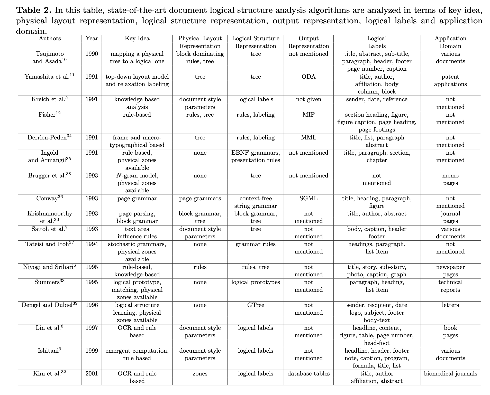

# Обзор возможной структуры документов

### Статьи

* [Text Type Structure and Logical Document Structure (2004)](https://ids-pub.bsz-bw.de/frontdoor/deliver/index/docId/9/file/Langer_Luengen_Bayerl_Towards_automatic_annotation_of_type_structure_2004.pdf)

Основная цель - не извлечение логической структуры, а разбиение документа по темам. 

Структура документов уже проаннотирована: научные статьи представлены в виде xml (например, на параграфы, секции, приложения)

Структура xml основана на специальном стандарте [DocBook standard (1999)](http://www.cs.unibo.it/~cianca/wwwpages/dd/Docbook.pdf), предназначенного в основном для написания технической литературы

Структура состоит из элементов, атрибутов и сущностей. Элементы представлены тегами, элементы могут включать атрибуты, сущности - это какие-то именованные данные, на которые можно ссылаться.
Всё очень похоже на html или xml, но SGML/XML убирает всю неоднозначность и явно всегда прописывает структуру (например заголовок секции явно будет прописан)

Основые особенности: ясность, структурированность (третий уровень секции не может идти сразу после первого), plain text (совместимость с разными платформами)

* [Basic Research in Computer Science: Document Structure Description (2000)](https://www.brics.dk/NS/00/7/BRICS-NS-00-7.pdf)

* [Document Structure (2003)](https://www.mitpressjournals.org/doi/pdfplus/10.1162/089120103322145315)

Помимо "физической" структуры документа (авторы предполагают иерархическую структуру) выделяют еще абстрактную структуру

Генерируют тексты. Структура документа предполагает наличие 6 уровней:

0 text-phrase
1 text-clause
2 text-sentence
3 paragraph
4 section
5 chapter

Абстрактная структура (rhetorical structure), которая предлагается, основана да сущностях и взаимоотношениях между ними (неупорядоченное дерево)

Учитывается смысл текста, то есть структура помогает определить еще и взаимосвязь частей предложения

* [Document Structure Analysis Algorithms: A Literature Survey (2003)](http://kanungo.com/pubs/spie03-layoutsurvey.pdf)

#### Обзор различных подходов и алгоритмов по извлечению логической структуры (уже довольно старый)

1) Документ может быть представлен как набор его физических компонент с метками (символы, слова, предложения, таблицы, графики и т. д.), то есть в виде плоской структуры

2) Для представления семантических связей между логическими компонентами (заголовок, авторы, секции и т. д.) может использоваться дерево

3) Краткое описание некоторых работ:

    * [Understanding multi-articled documents (1990)](https://ieeexplore.ieee.org/abstract/document/118163/) - "физическое" дерево (head, body) -> "логическое" дерево (title, abstract, sub-title, paragraph, header, footer, page number, caption)
    
    * A model based layout understanding method for the document recognition system (1991) - дерево, содержащее информацию о взаимном расположении объектов в документе
    
    * Logical structure descriptions of segmented document images (1991) - Превращение физической структуры в логическую на основе правил 
    
    * A top-down document analysis method for logical structure recognition (1991) - Используется формальное описание возможных классов документов.
    Это описание включает в себя правила композиции (общая логическая структура, описанная в форме Бэкуса-Наура) и правила представления (физические свойства логических сущностей).
    Описание документа - это граф, в вершинах которого находятся метки типов логических сущностей, которые необходимо распознать.
    Анализ документа подразумевает находжение пути в таком графе (при условии, что документ имеет структуру, подразумеваемую таким графом).
    
    * Modeling documents for structure recognition using generalized n-gram (1997) - Структура в виде дерева.
    Метод похож на n-граммы, основан на статистическом представлении образцов документов.
    Среди возможных деревьев выбирается наиболее близкое к выученной модели (модель учится на примерах).
    
    * Page grammars and page parsing: A syntatic approach to document layout recognition (1993) - Физическая и логическая структура документов.
    Физическая описана с помощью набора правил грамматики, определяемых соседними сущностями. Логическая структура описана контекстно-свободной грамматикой.
    
    * [Automatic Discovery of Logical Document Structure (1998)](https://ecommons.cornell.edu/bitstream/handle/1813/7352/98-1698.pdf;sequence=1)
    [Near-wordless document structure classification (1995)](http://www.cs.cornell.edu/info/people/summers/Papers/classify.ps) (тот же автор).
    Описан алгоритм автоматического вывода логической структуры документа из общей физической структуры.
    Для каждой логической метки описаны физические прототипы и 
    логическая структура извлекается путем измерения специальной метрики между физическими сегментами документа и предописанными прототипами.

Описаны метрики, с помощью оценивали качество систем.

Очень хорошая сравнительная таблица:

* [Use of document structure analysis to retrieve information from documents in digital libraries (1997)](http://citeseerx.ist.psu.edu/viewdoc/download?doi=10.1.1.55.473&rep=rep1&type=pdf)

DeLoS - document logical structure derivation system

Выделение структуры применяется для отобранных по запросу документов с целью дальнейшего выделения нужных логических компонентов
(при поиске по документам нам не нужен весь документ, а только конкретные его части)

DeLoS - специальная система, которая обрабатывает документы в виде изображений, на выходе выдает страницы, разбитые на блоки.
Помеченные блоки объединяются в смысловые части, которые выстраиваются в порядке чтения.

layout analysis (извлечение синтаксической структуры) -> извлечение логической структуры:

получается иерархический индекс из логических частей (units) с информацией об их типах, относительном расположениии и их компонентах

типы логических компонентов: газетная статья, лист цитирований, фотография, график и т. д.

Информация о физической и логической структуре документов разных типов представлялась в виде базы знаний.

* [Document Structure Analysis and Performance Evaluation (1999)](http://citeseerx.ist.psu.edu/viewdoc/download?doi=10.1.1.50.8068&rep=rep1&type=pdf)

* [Document Structure and Layout Analysis (2007)](http://citeseerx.ist.psu.edu/viewdoc/download?doi=10.1.1.104.1887&rep=rep1&type=pdf)

* [Logical Structure Recovery in Scholarly Articles with Rich Document Features (2012)](https://nlp.stanford.edu/~lmthang/data/papers/ijdls-SectLabel.pdf)

* [Learning to Extract Semantic Structure from Documents Using Multimodal Fully Convolutional Neural Networks (2017)](https://openaccess.thecvf.com/content_cvpr_2017/papers/Yang_Learning_to_Extract_CVPR_2017_paper.pdf)

* [Document Structure Extraction using Prior based High Resolution Hierarchical Semantic Segmentation (2019)](http://www.ecva.net/papers/eccv_2020/papers_ECCV/papers/123730647.pdf)

* [Multidomain Document Layout Understanding using Few Shot Object Detection (2018)](https://arxiv.org/pdf/1808.07330.pdf)

* [DocBank: A Benchmark Dataset for Document Layout Analysis (2020)](https://arxiv.org/pdf/2006.01038.pdf)